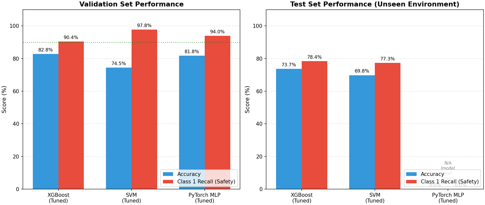
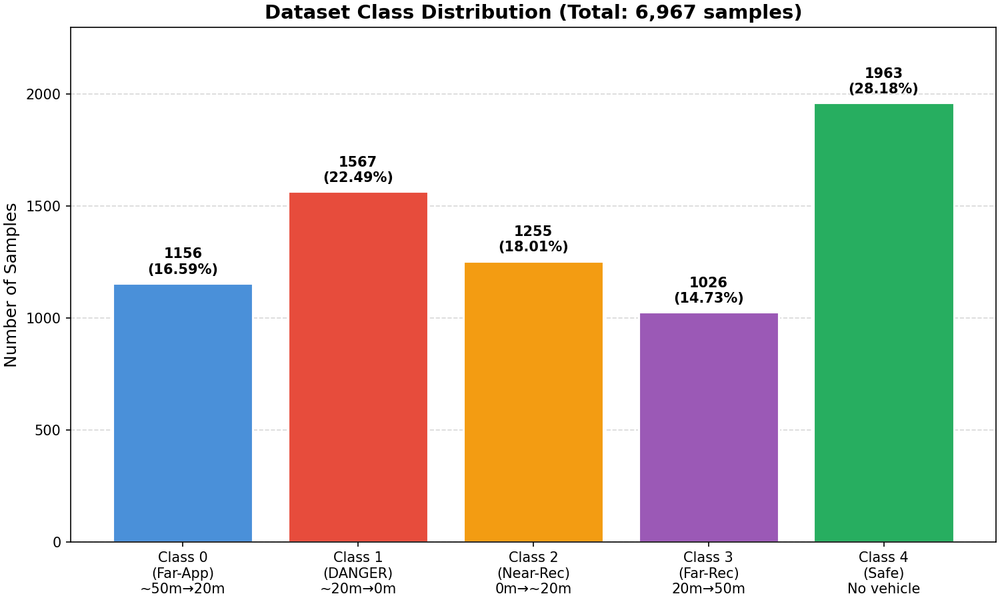
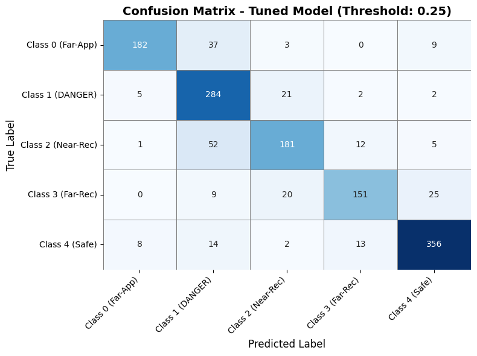
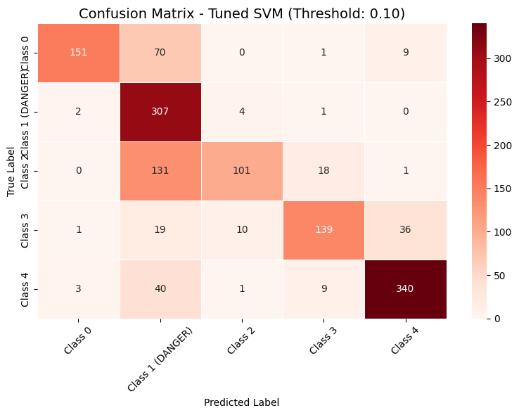
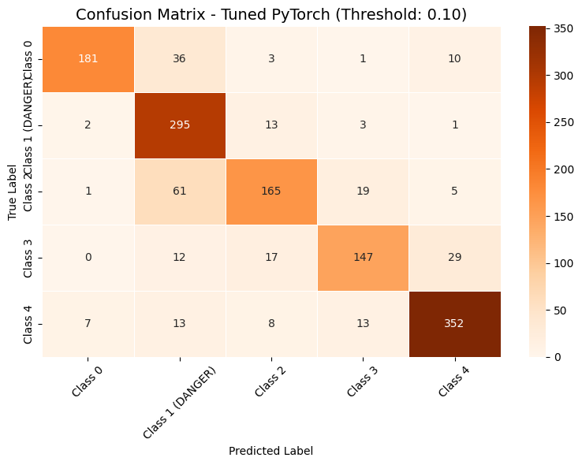
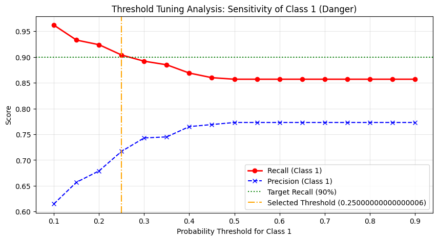
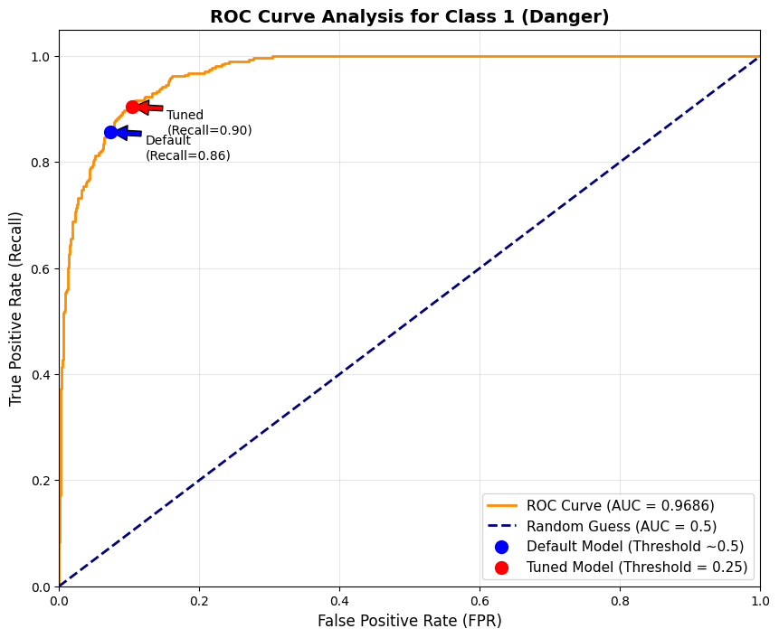
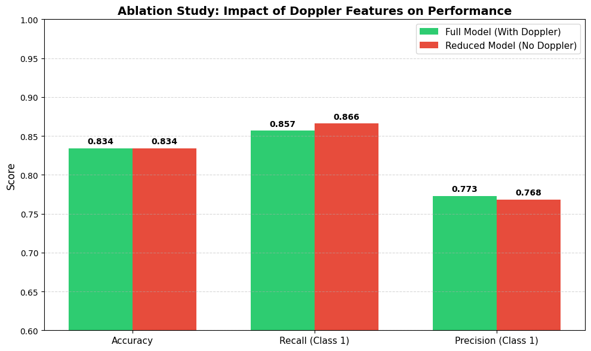
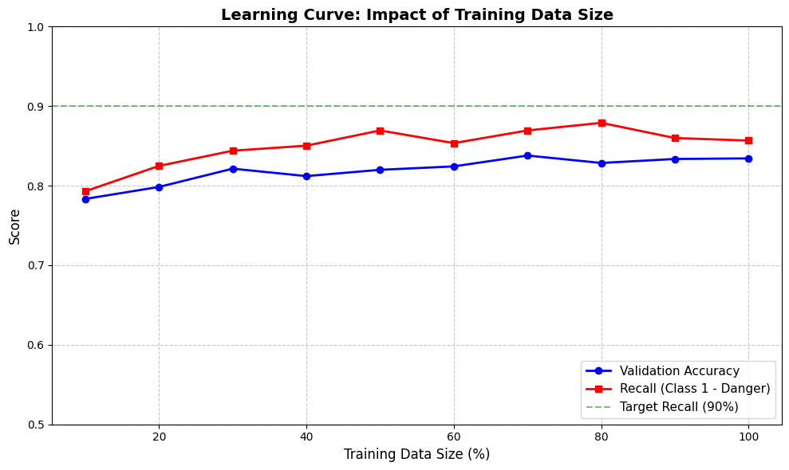
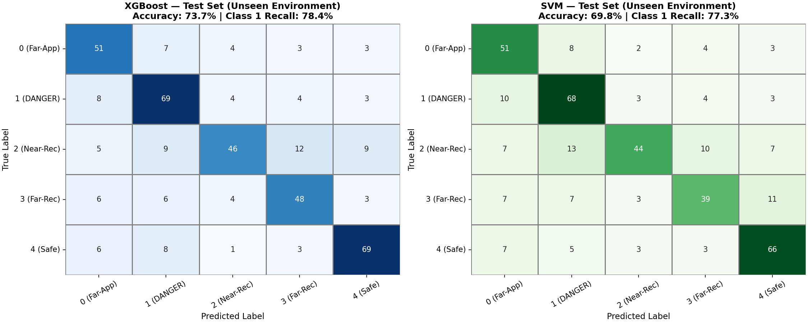

# 🚗 Acoustic Vehicle Distance Detection for Pedestrian Safety

> **A multi-class audio classification system that estimates vehicle proximity from acoustic features, with safety-oriented threshold tuning to maximize detection of approaching vehicles in the danger zone.**

[](LICENSE)
[](https://www.python.org/)
[]()
[]()

**📚 [Read this README in Persian (فارسی)](README_FA.md)** | **🌐 [View Project Page](https://your-username.github.io/vehicle-distance-detection/)**

---

## 📑 Table of Contents

- [Overview](#-overview)
- [Key Results](#-key-results)
- [Class Definitions](#-class-definitions)
- [Methodology](#-methodology)
- [Repository Structure](#-repository-structure)
- [Installation](#-installation)
- [Usage](#-usage)
- [Results & Analysis](#-results--analysis)
- [Dataset](#-dataset)
- [Citation](#-citation)
- [Authors & Acknowledgments](#-authors--acknowledgments)
- [License](#-license)

---

## 🎯 Overview

Traffic safety for vulnerable road users — especially visually impaired pedestrians — depends critically on early awareness of approaching vehicles. While computer vision systems are effective in daylight, they degrade in poor visibility conditions (night, fog, rain). **Audio-based sensing** offers a complementary, low-cost, weather-robust modality that can detect vehicles around corners and in low-visibility scenarios where line-of-sight sensors fail.

This project implements an end-to-end machine learning pipeline that classifies the distance and direction of a vehicle relative to a pedestrian using only a single microphone signal. The system extracts 132 acoustic features from each recording and trains three families of classifiers (XGBoost, SVM, and a PyTorch MLP), then applies **safety-oriented threshold tuning** to prioritize the detection of the danger zone (Class 1: vehicles within ~20 meters and approaching). This asymmetric design philosophy deliberately trades overall accuracy for higher recall on the safety-critical class, following the principle that a false alarm is far less costly than a missed danger warning.

The project was developed as part of an academic research effort and includes rigorous evaluation: validation on a held-out split, a file-level split to prevent data leakage, an ablation study on Doppler-inspired features, ROC/AUC analysis, a learning curve analysis, and — most importantly — testing on a completely **unseen dataset collected from a different environment** to assess real-world generalization.

---

## 📊 Key Results

### Validation Set (20% hold-out, stratified)

| Model | Accuracy | Class 1 Recall (Safety) | Class 1 Precision | AUC (Class 1) |
|-------|----------|--------------------------|-------------------|---------------|
| **XGBoost (Tuned)** | **82.8%** | **90.4%** | 71.7% | **0.969** |
| SVM (Tuned) | 74.5% | 97.8% | 54.1% | — |
| PyTorch MLP (Tuned) | 81.8% | 94.0% | 70.7% | — |

### Test Set (Unseen Environment — Generalization Check)

| Model | Accuracy | Class 1 Recall | TP | FN (Missed) |
|-------|----------|----------------|----|----|
| **XGBoost** | **73.7%** | 78.4% | 69 | 19 |
| SVM | 69.8% | 77.3% | 68 | 20 |
| PyTorch MLP | N/A (version mismatch) | — | — | — |

> **Interpretation:** The ~9% accuracy drop from validation to the unseen test environment is expected and reflects the domain shift between recording conditions. Notably, XGBoost maintains a strong Class 1 recall (78.4%) even on unseen data, detecting 69 out of 88 dangerous approaching-vehicle events. This demonstrates reasonable real-world generalization while highlighting the need for environment-robust features in future iterations.



---

## 🚦 Class Definitions

The system classifies audio recordings into **5 classes** based on the vehicle's distance and direction of travel:

| Class | Distance Range | Direction | Meaning |
|:-----:|:--------------:|:---------:|:--------|
| **0** | ~50m → 20m | Approaching | Far vehicle, getting closer |
| **1** | ~20m → 0m | Approaching | ⚠️ **DANGER ZONE** — vehicle close and approaching |
| **2** | 0m → ~20m | Receding | Near vehicle, moving away |
| **3** | 20m → 50m | Receding | Far vehicle, moving away |
| **4** | — | — | No vehicle present (Safe) |



**Why this design?** Class 1 is the safety-critical category — a missed detection here could cost a pedestrian their life. The threshold tuning strategy deliberately biases the model toward predicting Class 1 whenever there is meaningful probability, accepting more false alarms in exchange for fewer missed dangers.

---

## 🔬 Methodology

### Feature Extraction (132 features per sample)

Each `.wav` file is processed at a 22,050 Hz sample rate. After peak normalization and silence trimming (top-db=20), the following features are extracted:

| Feature Group | Count | Description |
|--------------|:-----:|-------------|
| MFCC (mean + std) | 40 | Mel-frequency cepstral coefficients (n=20), capturing timbral characteristics |
| Delta MFCC (mean + std) | 40 | First-order temporal derivative of MFCCs |
| Delta2 MFCC (mean + std) | 40 | Second-order temporal derivative of MFCCs |
| Spectral Centroid (mean + std) | 2 | Brightness center of the spectrum |
| Spectral Bandwidth (mean + std) | 2 | Spread of the spectrum around the centroid |
| Spectral Rolloff (mean + std) | 2 | Frequency below which 85% of energy lies |
| Zero Crossing Rate (mean + std) | 2 | Rate of sign changes in the signal |
| RMS Energy (mean + std) | 2 | Root-mean-square energy |
| Doppler Slope | 1 | Linear slope of spectral centroid over time (approaching vehicles shift upward) |
| Centroid Diff Std | 1 | Variability of spectral centroid changes |

### Models

1. **XGBoost** (Gradient Boosted Trees) — `n_estimators=300, max_depth=6, learning_rate=0.05`
2. **SVM** (RBF Kernel) — `C=1.0, gamma='scale', probability=True`
3. **PyTorch MLP** — 3 hidden layers (128→64→32) with BatchNorm and Dropout(0.3), trained for 50 epochs with Adam (lr=0.001)

### Safety-Oriented Threshold Tuning

Instead of using the default argmax decision rule, a custom threshold is applied to the predicted probability of Class 1. If `P(Class 1) > threshold`, the sample is forcibly classified as Class 1 regardless of other class probabilities. The threshold is selected to achieve **≥90% recall on Class 1** while maintaining the best possible precision.

### Evaluation Protocol

- **Validation split:** 80/20 stratified train/validation split (`random_state=42`)
- **File-Level Split:** To prevent data leakage from overlapping audio segments, a separate experiment splits at the file level before creating windowed segments
- **Ablation Study:** Removing the 2 Doppler-inspired features to measure their contribution
- **ROC/AUC Analysis:** Binary one-vs-rest evaluation for Class 1 detection
- **Learning Curve:** Training on 10%–100% of data to assess sample efficiency
- **Unseen Test Set:** 384 samples from a different recording environment

---

## 📁 Repository Structure

```
vehicle-distance-detection/
├── README.md                              # This file (English)
├── README_FA.md                           # Persian README
├── UPLOAD_GUIDE.md                        # Step-by-step GitHub upload guide (فارسی)
├── LICENSE                                # MIT License
├── CITATION.cff                           # Citation metadata for academic use
├── requirements.txt                       # Python dependencies
├── .gitignore                             # Git ignore rules
│
├── notebooks/
│   ├── vehicle_distance_detection.ipynb   # Main training & evaluation pipeline
│   └── test.ipynb                         # Testing on unseen data (new environment)
│
├── src/
│   ├── feature_extraction.py              # Reusable feature extraction module
│   ├── model.py                           # Model definitions (PyTorch MLP)
│   └── predict.py                         # Inference script for new audio files
│
├── images/                                # Charts and figures used in README
│   ├── class_distribution.png
│   ├── model_comparison_val_vs_test.png
│   ├── roc_curve_class1.png
│   ├── learning_curve.png
│   ├── threshold_tuning_analysis.png
│   ├── xgboost_confusion_matrix_tuned.png
│   ├── svm_confusion_matrix_tuned.png
│   ├── pytorch_confusion_matrix_tuned.png
│   ├── ablation_study_doppler.png
│   ├── test_set_confusion_matrices.png
│   └── model_comparison_charts.png
│
├── docs/
│   └── index.html                         # Bilingual project page (GitHub Pages)
│
├── data/
│   └── README.md                          # Dataset information (data not included yet)
│
├── models/
│   └── README.md                          # Trained model information (not included)
│
└── results/
    └── summary.md                         # Consolidated results table
```

---

## ⚙️ Installation

### Prerequisites

- Python 3.8 or higher
- pip package manager

### Setup

```bash
# Clone the repository
git clone https://github.com/your-username/vehicle-distance-detection.git
cd vehicle-distance-detection

# Create a virtual environment (recommended)
python -m venv venv
source venv/bin/activate        # On Windows: venv\Scripts\activate

# Install dependencies
pip install -r requirements.txt
```

### Dependencies

The project relies on the following key libraries:

- `librosa` — Audio feature extraction
- `xgboost` — Gradient boosting classifier
- `scikit-learn` — SVM, metrics, preprocessing
- `torch` — PyTorch MLP
- `numpy`, `pandas` — Data manipulation
- `matplotlib`, `seaborn` — Visualization
- `joblib` — Model serialization
- `tqdm` — Progress bars

---

## 🚀 Usage

### 1. Train the Models (Full Pipeline)

Open and run the main notebook:

```bash
jupyter notebook notebooks/vehicle_distance_detection.ipynb
```

**Before running**, update the path variables in the first code cell to point to your `.wav` files:

```python
DATA_FOLDER = "/path/to/your/wav/files"
OUTPUT_CSV = "./audio_features_dataset.csv"
```

The notebook will:
1. Extract 132 features from each `.wav` file
2. Train XGBoost, SVM, and PyTorch MLP models
3. Apply safety-oriented threshold tuning
4. Generate all evaluation charts and reports
5. Save trained models (`.pkl` and `.pth` files)

### 2. Test on New Data

```bash
jupyter notebook notebooks/test.ipynb
```

Update `TEST_DATA_FOLDER` to point to your new test audio files. The notebook loads the saved models and evaluates them on the unseen data.

### 3. Use the Modular API

For programmatic use, the `src/` module provides reusable functions:

```python
from src.feature_extraction import extract_features_from_file
from src.predict import load_model, predict

# Extract features from a single audio file
features = extract_features_from_file("path/to/audio.wav")

# Load a trained model and predict
model = load_model("models/xgboost_audio_model.pkl")
prediction, probabilities = predict(model, features)
print(f"Predicted class: {prediction}")
```

### 4. Run the Project Website (Optional)

The `docs/index.html` file is a standalone bilingual project page. To view it:

- **Locally:** Open `docs/index.html` in any web browser
- **On GitHub Pages:** Enable GitHub Pages in repository Settings → Pages → Source: `main` branch, `/docs` folder

---

## 📈 Results & Analysis

### Confusion Matrices (Tuned Models on Validation Set)

| XGBoost | SVM | PyTorch |
|:-------:|:---:|:-------:|
|  |  |  |

### Threshold Tuning Analysis (XGBoost, Class 1)



The analysis sweeps the probability threshold from 0.10 to 0.90. A threshold of **0.25** was selected as it achieves the target 90% recall while maintaining reasonable precision (71.7%). Lower thresholds increase recall further but at a steep precision cost.

### ROC Curve (Class 1 — Danger)



The AUC of **0.969** indicates excellent separability between the danger class and all other classes. The tuned operating point (red) moves up the curve compared to the default (blue), increasing recall from 85.7% to 90.4% at the cost of a higher false positive rate (from 7.3% to 10.4%).

### Ablation Study: Impact of Doppler Features



Removing the two Doppler-inspired features (spectral centroid slope and centroid diff std) resulted in only a **negligible change** in Class 1 recall (-0.96%). This suggests that the MFCC and spectral features already capture most of the information needed for distance classification, and the Doppler-inspired features are largely redundant in this feature set.

### Learning Curve



The model shows **moderate improvement** as data increases from 50% to 100% (accuracy: 82.0% → 83.4%). The model converges reasonably by 50% of the data (2,786 samples), but the full dataset provides additional robustness and stability.

### Test Set Performance (Unseen Environment)



On the unseen test set (384 samples from a different recording environment), XGBoost achieved 73.7% accuracy and 78.4% Class 1 recall. The performance drop from validation (82.8% → 73.7%) reflects the domain shift between recording environments — a common challenge in real-world audio classification. Despite this, the model still detects 69 out of 88 dangerous events.

---

## 📀 Dataset

The dataset consists of **6,967 audio recordings** (`.wav` format, 22,050 Hz) of vehicle pass-by events, annotated with 5 distance-based classes.

| Class | Samples | Percentage |
|:-----:|:-------:|:----------:|
| 0 | 1,156 | 16.59% |
| 1 (Danger) | 1,567 | 22.49% |
| 2 | 1,255 | 18.01% |
| 3 | 1,026 | 14.73% |
| 4 (Safe) | 1,963 | 28.18% |
| **Total** | **6,967** | **100%** |

> **Status:** The dataset is being prepared for public release. It will be shared under a Creative Commons license upon publication of the accompanying research paper. Please contact the authors for early access requests.

File naming convention: `number_class.wav` or `number_class-extra.wav` (e.g., `12_3.wav`, `8_1-4.wav`).

---

## 📝 Citation

If you use this code or build upon this work, please cite it as follows:

```bibtex
@misc{shabestani2026vehicle,
  title={Acoustic Vehicle Distance Detection for Pedestrian Safety:
         A Multi-Class Audio Classification Approach with Safety-Oriented Threshold Tuning},
  author={Shabestani, Hananeh and Zaheri Azam, Setayesh},
  year={2026},
  howpublished={\\url{https://github.com/your-username/vehicle-distance-detection}},
  note={Accessed: 2026}
}
```

See [CITATION.cff](CITATION.cff) for machine-readable citation metadata.

---

## 👥 Authors & Acknowledgments

### Authors

- **Hananeh Shabestani** — Conceptualization, Methodology, Implementation, Analysis
- **Setayesh Zaheri Azam** — Data Collection, Implementation, Analysis

### Acknowledgments

The authors gratefully acknowledge **Dr. Moharram Mansourizadeh** for his valuable guidance, supervision, and insightful feedback throughout the course of this research project. His expertise and suggestions significantly contributed to the design and refinement of the methodology.

---

## 📄 License

This project is licensed under the **MIT License** — see the [LICENSE](LICENSE) file for details.

You are free to:
- ✅ Use, copy, modify, merge, publish, distribute, and sublicense the code
- ✅ Use this project for commercial purposes
- ✅ Build upon this work

**Condition:** Include the original copyright notice and license text in all copies or substantial portions of the software.

---

## 🔮 Future Work

- **Environment robustness:** Collect data from diverse environments and explore domain adaptation techniques to reduce the validation-to-test performance gap
- **End-to-end deep learning:** Train a CNN directly on spectrograms rather than handcrafted features
- **Real-time implementation:** Optimize the pipeline for embedded devices (e.g., Raspberry Pi) for real-time pedestrian assistance
- **Multi-modal fusion:** Combine audio with other sensor modalities (e.g., radar, ultrasonic) for enhanced reliability
- **Temporal modeling:** Explore RNN/Transformer architectures to model the temporal dynamics of vehicle approach patterns

---

## 📬 Contact

For questions, collaborations, or early access to the dataset, please reach out via:
- Opening an issue in this repository
- Contacting the authors through their institutional emails

---

*This project was developed as part of an academic research initiative for pedestrian safety applications.*
